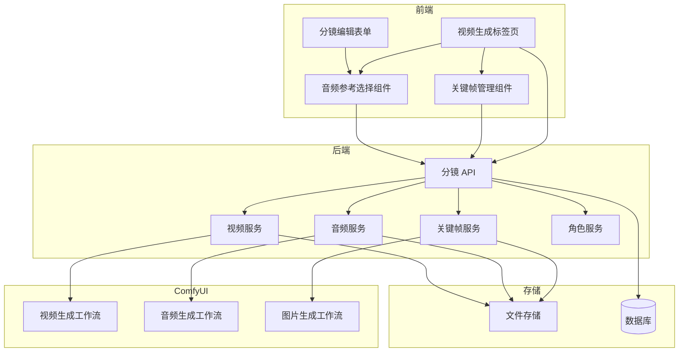
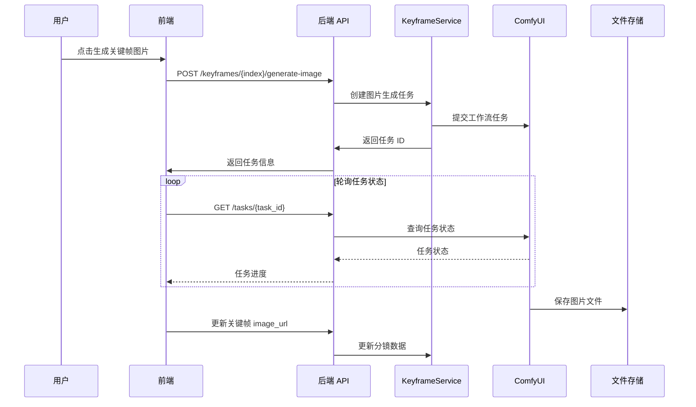
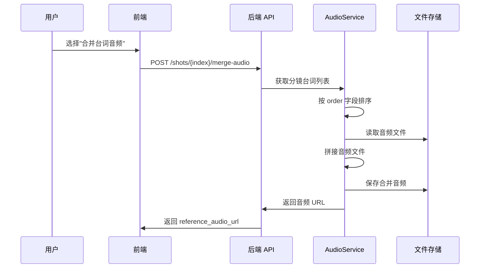

# 详细设计文档

## 1. 背景与现状

### 1.1 技术背景

AI-NovelFlow 是一个 AI 视频生成系统，当前架构：
- **后端**：FastAPI + SQLAlchemy，通过 ComfyUI 工作流执行 AI 生成任务
- **前端**：React + TypeScript，使用 Ant Design 组件库
- **任务系统**：通过轮询机制追踪 ComfyUI 任务状态
- **存储**：本地文件系统存储生成的图片和音频

现有视频生成流程：
1. 用户为分镜生成分镜图片
2. 用户创建视频生成任务，使用分镜图片作为首帧
3. 调用 ComfyUI 视频生成工作流
4. 轮询任务状态，完成后更新分镜视频 URL

### 1.2 现状分析

**现有限制**：
1. 视频生成仅支持单张首帧图片，无法控制中间关键动作
2. 不支持音频参考输入，无法实现口型同步
3. 分镜台词仅支持角色台词，不支持旁白
4. 台词音频合并时无时序控制

**技术约束**：
- ComfyUI 工作流节点需用户自行配置
- 节点映射采用配置文件方式，支持动态扩展

### 1.3 关键干系人

- **前端开发**：需要新增关键帧管理组件、音频参考选择组件
- **后端开发**：需要扩展数据模型、新增 API 接口
- **用户**：需要配置 ComfyUI 工作流以支持关键帧和音频参考节点

## 2. 设计目标

### 目标

1. 支持多关键帧控制视频生成，每个关键帧可独立编辑描述和生成/上传图片
2. 支持音频作为视频生成的参考输入（口型同步）
3. 支持旁白台词解析和音频生成
4. 保持与现有架构的一致性，最大化代码复用

### 非目标

1. 不涉及视频提取关键帧功能
2. 不涉及 ComfyUI 工作流的具体实现，仅提供节点映射配置
3. 不涉及音频编辑功能

## 3. 整体架构

### 3.1 架构概览



### 3.2 核心组件

| 组件名 | 职责说明 |
| --- | --- |
| KeyframesManager | 前端关键帧管理组件，支持添加、编辑、删除关键帧，支持 AI 生成描述和图片 |
| AudioRefSelector | 前端音频参考选择组件，支持选择音频来源（合并台词/上传/角色音色/无） |
| KeyframeService | 后端关键帧服务，处理关键帧描述生成、图片生成/上传逻辑 |
| AudioService | 后端音频服务，处理音频合并、旁白音频生成逻辑 |
| CharacterService | 后端角色服务，新增旁白角色自动创建、查询逻辑 |

### 3.3 数据流设计

#### 关键帧图片生成流程



#### 音频合并流程



## 4. 详细设计

### 4.1 接口设计

#### 接口：生成关键帧描述

- **请求方式**：POST
- **请求路径**：`/api/novels/{novel_id}/chapters/{chapter_id}/shots/{shot_index}/keyframes/generate-descriptions`
- **请求参数**：

| 参数名 | 类型 | 必填 | 说明 |
| --- | --- | --- | --- |
| keyframe_count | int | 是 | 关键帧数量 |

- **响应结构**：

```json
{
  "success": true,
  "data": {
    "keyframes": [
      {
        "frame_index": 0,
        "description": "开场：主角站在窗前望向远方..."
      },
      {
        "frame_index": 1,
        "description": "转折：主角转身露出坚定表情..."
      }
    ]
  }
}
```

#### 接口：生成关键帧图片

- **请求方式**：POST
- **请求路径**：`/api/novels/{novel_id}/chapters/{chapter_id}/shots/{shot_index}/keyframes/{frame_index}/generate-image`
- **请求参数**：无

- **响应结构**：

```json
{
  "success": true,
  "data": {
    "task_id": "task_123",
    "status": "pending"
  }
}
```

#### 接口：上传关键帧图片

- **请求方式**：POST
- **请求路径**：`/api/novels/{novel_id}/chapters/{chapter_id}/shots/{shot_index}/keyframes/{frame_index}/upload-image`
- **请求参数**：multipart/form-data

| 参数名 | 类型 | 必填 | 说明 |
| --- | --- | --- | --- |
| file | File | 是 | 图片文件（PNG/JPG/WEBP） |

- **响应结构**：

```json
{
  "success": true,
  "data": {
    "image_url": "/static/story_xxx/keyframes/shot_1_frame_0.png"
  }
}
```

#### 接口：上传关键帧参考图

- **请求方式**：POST
- **请求路径**：`/api/novels/{novel_id}/chapters/{chapter_id}/shots/{shot_index}/keyframes/{frame_index}/upload-reference-image`
- **请求参数**：multipart/form-data

| 参数名 | 类型 | 必填 | 说明 |
| --- | --- | --- | --- |
| file | File | 是 | 参考图片文件（PNG/JPG/WEBP） |

- **响应结构**：

```json
{
  "success": true,
  "data": {
    "reference_image_url": "/static/story_xxx/keyframes/shot_1_frame_0_ref.png"
  }
}
```

#### 接口：设置关键帧参考图

- **请求方式**：PUT
- **请求路径**：`/api/novels/{novel_id}/chapters/{chapter_id}/shots/{shot_index}/keyframes/{frame_index}/reference-image`
- **请求参数**：

| 参数名 | 类型 | 必填 | 说明 |
| --- | --- | --- | --- |
| reference_image_url | string | 否 | 参考图 URL，null 表示不使用参考图 |
| auto_select | boolean | 否 | 是否自动选择参考图，为 true 时自动填入分镜图或上一关键帧图 |

- **响应结构**：

```json
{
  "success": true,
  "data": {
    "reference_image_url": "/static/story_xxx/shot_1.png"
  }
}
```

#### 接口：上传参考音频

- **请求方式**：POST
- **请求路径**：`/api/novels/{novel_id}/chapters/{chapter_id}/shots/{shot_index}/upload-reference-audio`
- **请求参数**：multipart/form-data

| 参数名 | 类型 | 必填 | 说明 |
| --- | --- | --- | --- |
| file | File | 是 | 音频文件（MP3/WAV/FLAC） |

- **响应结构**：

```json
{
  "success": true,
  "data": {
    "reference_audio_url": "/static/story_xxx/reference_audio/shot_1.flac"
  }
}
```

#### 接口：合并台词音频

- **请求方式**：POST
- **请求路径**：`/api/novels/{novel_id}/chapters/{chapter_id}/shots/{shot_index}/merge-audio`
- **请求参数**：无

- **响应结构**：

```json
{
  "success": true,
  "data": {
    "reference_audio_url": "/static/story_xxx/merged_audio/shot_1_merged.flac",
    "duration": 12.5
  }
}
```

#### 接口：设置参考音频来源

- **请求方式**：POST
- **请求路径**：`/api/novels/{novel_id}/chapters/{chapter_id}/shots/{shot_index}/set-reference-audio`
- **请求参数**：

| 参数名 | 类型 | 必填 | 说明 |
| --- | --- | --- | --- |
| source_type | string | 是 | 音频来源类型：none/merged/uploaded/character |
| character_id | string | 否 | 角色 ID（source_type=character 时必填） |

- **响应结构**：

```json
{
  "success": true,
  "data": {
    "reference_audio_url": "https://..."
  }
}
```

### 4.2 数据模型

#### 修改数据表：shots

| 字段名 | 类型 | 必填 | 说明 |
| --- | --- | --- | --- |
| keyframes | JSON | 否 | 关键帧列表，JSON 数组 |
| reference_audio_url | String | 否 | 参考音频 URL |

**keyframes 字段结构**：

```json
[
  {
    "frame_index": 0,
    "description": "关键帧描述文本",
    "image_url": "/static/xxx/xxx.png",
    "image_task_id": "task_xxx",
    "reference_image_url": "/static/xxx/shot.png"
  }
]
```

**reference_image_url 字段说明**：
- `null`：不使用参考图，采用纯文本生成
- 具体URL：使用该图片作为参考图（可能是分镜图、其他关键帧图、或用户上传图）

**自动选择参考图逻辑**：
- `frame_index == 0`：使用分镜图（shot_image_url）
- `frame_index > 0`：使用上一关键帧的 image_url（keyframes[frame_index - 1].image_url）

#### 修改数据表：characters

| 字段名 | 类型 | 必填 | 说明 |
| --- | --- | --- | --- |
| is_narrator | Boolean | 否 | 是否为旁白角色，默认 false |

#### 更新 dialogues 字段结构（shots 表）

```json
[
  {
    "type": "character",
    "order": 0,
    "character_name": "张三",
    "text": "台词文本",
    "emotion_prompt": "自然",
    "audio_url": "/static/xxx/xxx.flac",
    "audio_task_id": "task_xxx",
    "audio_source": "ai_generated"
  },
  {
    "type": "narration",
    "order": 1,
    "character_name": "旁白",
    "text": "旁白文本",
    "emotion_prompt": "自然",
    "audio_url": "/static/xxx/xxx.flac",
    "audio_task_id": "task_xxx",
    "audio_source": "ai_generated"
  }
]
```

### 4.3 SQL逻辑

#### 查询：获取旁白角色

```sql
SELECT id, name, voice_prompt, reference_audio_url
FROM characters
WHERE novel_id = :novel_id AND is_narrator = true
```

**说明**：查询指定小说的旁白角色，用于旁白音频生成时获取参考音频。

#### 查询：获取分镜台词音频列表

```sql
SELECT
    s.id as shot_id,
    s.dialogues
FROM shots s
WHERE s.chapter_id = :chapter_id AND s.shot_index = :shot_index
```

**说明**：从 shots 表中获取分镜的台词数据，解析 JSON 后按 `order` 字段排序获取音频 URL。

### 4.4 核心算法

#### 关键帧参考图自动选择算法

```python
def get_auto_reference_image_url(shot: Shot, keyframes: list, frame_index: int) -> str | None:
    """
    自动选择关键帧参考图
    - frame_index == 0: 使用分镜图
    - frame_index > 0: 使用上一关键帧的图片
    """
    if frame_index == 0:
        return shot.image_url  # 分镜图
    else:
        prev_keyframe = keyframes[frame_index - 1]
        if prev_keyframe.get('image_url'):
            return prev_keyframe['image_url']
        else:
            # 上一关键帧还没图片，回退到分镜图
            return shot.image_url
```

#### 关键帧图片生成算法

```python
async def generate_keyframe_image(
    shot: Shot,
    keyframes: list,
    frame_index: int,
    node_mapping: dict
) -> str:
    """
    生成关键帧图片，支持参考图
    """
    keyframe = keyframes[frame_index]

    # 获取参考图
    reference_image_url = keyframe.get('reference_image_url')

    if reference_image_url:
        # 上传参考图到 ComfyUI
        ref_upload_result = await comfyui_service.client.upload_image(
            url_to_local_path(reference_image_url)
        )
        ref_filename = ref_upload_result.get('filename')
    else:
        ref_filename = None

    # 构建工作流
    workflow = load_workflow('keyframe_image_gen')

    # 注入提示词
    prompt_node_id = node_mapping.get('prompt_node_id')
    workflow[prompt_node_id]['inputs']['text'] = keyframe['description']

    # 注入参考图（如果有）
    if ref_filename:
        ref_node_id = node_mapping.get('reference_image_node_id')
        if ref_node_id and ref_node_id in workflow:
            workflow[ref_node_id]['inputs']['image'] = ref_filename

    # 提交任务
    task_id = await comfyui_service.client.submit(workflow)
    return task_id
```

#### 关键帧描述生成算法

```python
async def generate_keyframe_descriptions(shot: Shot, keyframe_count: int) -> list[dict]:
    """
    基于分镜描述生成关键帧描述
    """
    prompt = f"""
    你是一个专业的分镜师。请根据以下分镜信息，为 {keyframe_count} 个关键帧生成描述。

    分镜描述：{shot.description}
    角色信息：{shot.characters}
    剧情内容：{shot.story_content}

    要求：
    1. 每个关键帧描述应该描述该帧的画面内容
    2. 描述应该体现动作的连续性和变化
    3. 第一个关键帧通常是分镜的起始画面
    4. 最后一个关键帧通常是分镜的结束画面

    请返回 JSON 数组格式：
    [
      {{"frame_index": 0, "description": "..."}},
      {{"frame_index": 1, "description": "..."}}
    ]
    """

    result = await llm_client.generate(prompt)
    return json.loads(result)
```

#### 音频合并算法

```python
async def merge_dialogue_audio(shot: Shot) -> str:
    """
    按时序合并分镜内所有台词音频
    """
    # 获取台词列表并按 order 排序
    dialogues = sorted(shot.dialogues, key=lambda d: d.get('order', 0))

    # 收集音频文件路径
    audio_files = []
    for dialogue in dialogues:
        if dialogue.get('audio_url'):
            audio_files.append(dialogue['audio_url'])

    if not audio_files:
        raise ValueError("没有可合并的音频文件")

    # 使用 ffmpeg 合并音频
    output_path = f"story_{shot.novel_id}/merged_audio/shot_{shot.id}_merged.flac"

    # 创建文件列表
    list_file = create_audio_list_file(audio_files)

    # 执行 ffmpeg 合并
    subprocess.run([
        'ffmpeg', '-f', 'concat', '-safe', '0',
        '-i', list_file, '-c', 'copy', output_path
    ], check=True)

    return output_path
```

#### 旁白角色自动创建算法

```python
async def ensure_narrator_character(novel_id: str) -> Character:
    """
    确保小说有旁白角色，不存在则创建
    """
    # 查询是否已存在旁白角色
    narrator = await character_repo.find_by_novel_and_narrator(novel_id)
    if narrator:
        return narrator

    # 创建旁白角色
    narrator = Character(
        novel_id=novel_id,
        name="旁白",
        is_narrator=True,
        description="小说旁白角色，用于生成旁白音频"
    )
    await character_repo.create(narrator)
    return narrator
```

### 4.5 异常处理

| 异常场景 | 处理策略 |
| --- | --- |
| 关键帧图片生成失败 | 返回错误信息，允许用户重试或上传图片 |
| 音频合并时部分台词无音频 | 跳过无音频的台词，合并已有音频；若无任何音频返回错误 |
| 旁白角色无参考音频 | 返回错误提示，引导用户为旁白角色配置音色 |
| 上传文件格式不支持 | 返回 400 错误，提示支持的文件格式 |
| 关键帧数量超过工作流支持上限 | 返回警告信息，仅使用工作流支持的关键帧数量 |

### 4.6 前端组件设计

#### TypeScript 类型定义

```typescript
// types/index.ts 扩展

// 关键帧数据
export interface KeyframeData {
  frame_index: number;
  description: string;
  image_url?: string;
  image_task_id?: string;
  reference_image_url?: string | null;
}

// 扩展 ShotData
export interface ShotData {
  // ... 现有字段
  keyframes?: KeyframeData[];
  reference_audio_url?: string;
}

// 扩展 DialogueData
export interface DialogueData {
  // ... 现有字段
  type?: 'character' | 'narration';
  order?: number;
}

// 扩展 Character
export interface Character {
  // ... 现有字段
  isNarrator?: boolean;
}
```

#### KeyframesManager 组件设计

```typescript
// components/KeyframesManager.tsx

interface KeyframesManagerProps {
  novelId: string;
  chapterId: string;
  shotIndex: number;
  shotData: ShotData;
  onKeyframesChange: (keyframes: KeyframeData[]) => void;
}

// 组件内部状态
interface KeyframeManagerState {
  keyframes: KeyframeData[];
  generatingIndex: number | null;       // 正在生成图片的关键帧索引
  uploadingIndex: number | null;        // 正在上传的关键帧索引
  expandedIndex: number | null;         // 展开编辑的关键帧索引
  previewImage: string | null;          // 预览图片 URL
}

// 参考图选择模式
type ReferenceMode = 'auto' | 'upload' | 'none';
```

组件 UI 结构：

```
┌─────────────────────────────────────────────────────────────────┐
│  关键帧设置                              [AI生成描述] [添加]   │
├─────────────────────────────────────────────────────────────────┤
│  ┌─────────────────────────────────────────────────────────────┐│
│  │ 帧 0                              [生成图片] [上传] [删除] ││
│  │ 描述: ________________________________________________     ││
│  │ 参考图: ● 自动选择(分镜图)  ○ 上传  ○ 不使用               ││
│  │ ┌──────────┐ ┌──────────┐                                 ││
│  │ │ 参考图   │ │ 生成图   │                                 ││
│  │ │ [预览]   │ │ [预览]   │                                 ││
│  │ └──────────┘ └──────────┘                                 ││
│  └─────────────────────────────────────────────────────────────┘│
│                                                                 │
│  ┌─────────────────────────────────────────────────────────────┐│
│  │ 帧 1                              [生成图片] [上传] [删除] ││
│  │ 描述: ________________________________________________     ││
│  │ 参考图: ● 自动选择(帧0)  ○ 上传  ○ 不使用                  ││
│  │ ┌──────────┐ ┌──────────┐                                 ││
│  │ │ 参考图   │ │ 生成图   │                                 ││
│  │ │ [预览]   │ │ [加载中] │                                 ││
│  │ └──────────┘ └──────────┘                                 ││
│  └─────────────────────────────────────────────────────────────┘│
└─────────────────────────────────────────────────────────────────┘
```

#### AudioReferenceSelector 组件设计

```typescript
// components/AudioReferenceSelector.tsx

interface AudioReferenceSelectorProps {
  novelId: string;
  chapterId: string;
  shotIndex: number;
  shotData: ShotData;
  characters: Character[];              // 该分镜的角色列表
  onReferenceAudioChange: (url: string | null) => void;
}

// 音频来源类型
type AudioSourceType = 'none' | 'merged' | 'uploaded' | 'character';

// 组件内部状态
interface AudioReferenceSelectorState {
  sourceType: AudioSourceType;
  selectedCharacterId: string | null;
  isMerging: boolean;
  isUploading: boolean;
  audioUrl: string | null;
  isPlaying: boolean;
}
```

组件 UI 结构：

```
┌─────────────────────────────────────────────────────────────────┐
│  音频参考设置                                                    │
├─────────────────────────────────────────────────────────────────┤
│  参考音频来源：                                                  │
│  ○ 无音频参考                                                   │
│  ○ 合并台词音频  [合并中...] 或 [已有合并音频: 12.5s]           │
│  ○ 上传音频文件  [选择文件]                                      │
│  ○ 角色音色     [选择角色 ▼]                                    │
│                                                                 │
│  ┌─────────────────────────────────────────────────────────┐   │
│  │ ▶ ──────────────────────────●─────── 12:34/45:00       │   │
│  └─────────────────────────────────────────────────────────┘   │
└─────────────────────────────────────────────────────────────────┘
```

#### ShotForm 台词编辑扩展

```
台词列表扩展：

┌─────────────────────────────────────────────────────────────────┐
│  角色台词 (3)                                    [展开] [折叠] │
├─────────────────────────────────────────────────────────────────┤
│  ┌─────────────────────────────────────────────────────────────┐│
│  │ ⋮⋮ 台词 1 [角色]                                  [删除] ││
│  │ 角色: [张三 ▼]           序号: 0                            ││
│  │ 文本: ________________________________________________     ││
│  │ 情感: [自然]  [生成音频] [▶播放]                           ││
│  └─────────────────────────────────────────────────────────────┘│
│  ┌─────────────────────────────────────────────────────────────┐│
│  │ ⋮⋮ 台词 2 [旁白]                                  [删除] ││
│  │ 类型: 旁白                序号: 1                            ││
│  │ 文本: ________________________________________________     ││
│  │ 情感: [自然]  [生成音频] [▶播放]                           ││
│  └─────────────────────────────────────────────────────────────┘│
│  ┌─────────────────────────────────────────────────────────────┐│
│  │ ⋮⋮ 台词 3 [角色]                                  [删除] ││
│  │ 角色: [李四 ▼]           序号: 2                            ││
│  │ 文本: ________________________________________________     ││
│  │ 情感: [激动]  [重新生成] [▶播放]                           ││
│  └─────────────────────────────────────────────────────────────┘│
│                                                                 │
│  [+ 添加台词]  [+ 添加旁白]                                      │
└─────────────────────────────────────────────────────────────────┘
```

### 4.7 前端状态管理设计

#### Zustand Store 扩展

```typescript
// stores/slices/shotSlice.ts 扩展

interface ShotSlice {
  // 现有状态...

  // 新增：关键帧状态
  keyframeGenerating: Set<string>;     // 格式: "shotIndex_frameIndex"
  keyframeUploading: Set<string>;

  // 新增：参考音频状态
  audioMerging: Set<number>;          // 正在合并的分镜索引
  audioUploading: Set<number>;

  // 新增：台词编辑状态
  dialogueEditing: Map<string, DialogueData>;  // 编辑缓存

  // 新增方法
  addKeyframe: (shotIndex: number) => void;
  updateKeyframe: (shotIndex: number, frameIndex: number, data: Partial<KeyframeData>) => void;
  deleteKeyframe: (shotIndex: number, frameIndex: number) => void;
  generateKeyframeImage: (novelId: string, chapterId: string, shotIndex: number, frameIndex: number) => Promise<void>;

  setReferenceAudio: (shotIndex: number, url: string | null) => void;
  mergeDialogueAudio: (novelId: string, chapterId: string, shotIndex: number) => Promise<void>;

  addDialogue: (shotIndex: number, type: 'character' | 'narration') => void;
  updateDialogue: (shotIndex: number, dialogueIndex: number, data: Partial<DialogueData>) => void;
  reorderDialogues: (shotIndex: number, fromIndex: number, toIndex: number) => void;
}
```

#### 参考图自动选择 Hook

```typescript
// hooks/useAutoReferenceImage.ts

function useAutoReferenceImage(
  shotData: ShotData,
  keyframes: KeyframeData[],
  frameIndex: number
): string | null {
  // 自动选择逻辑
  if (frameIndex === 0) {
    // 第一个关键帧使用分镜图
    return shotData.image_url || null;
  } else {
    // 后续关键帧使用上一个关键帧的图片
    const prevKeyframe = keyframes[frameIndex - 1];
    return prevKeyframe?.image_url || null;
  }
}
```

## 5. 技术决策

### 决策1：旁白音色存储位置

- **选型方案**：作为特殊角色存储在 characters 表，新增 `is_narrator` 标识字段
- **选择理由**：
  1. 复用现有角色音色配置逻辑和 UI
  2. 无需新增小说级别配置页面
  3. 音频生成逻辑可统一处理
- **备选方案**：在 novels 表新增旁白音色字段
- **放弃原因**：需要新增小说级别配置 UI，增加开发成本

### 决策2：台词时序控制实现

- **选型方案**：在台词数据中新增 `order` 字段
- **选择理由**：
  1. 简单直观，易于理解和使用
  2. 支持灵活调整台词顺序
  3. 与现有台词数据结构兼容
- **备选方案**：使用时间戳字段控制
- **放弃原因**：时间戳精度处理复杂，音频合并时需要额外计算间隔

### 决策3：关键帧节点映射命名约定

- **选型方案**：使用 `keyframe_node_N` 动态命名
- **选择理由**：
  1. 与现有 `shot_image_node_id` 命名风格一致
  2. 支持任意数量的关键帧
  3. 用户易于理解和配置
- **备选方案**：使用数组配置 `keyframe_node_ids: ["node_1", "node_2"]`
- **放弃原因**：需要修改现有的节点映射配置解析逻辑

## 6. 风险评估

| 风险点 | 风险等级 | 应对策略 |
| --- | --- | --- |
| 多关键帧增加视频生成时间 | 中 | 提示用户关键帧数量建议，支持预览关键帧效果 |
| 音频合并质量损失 | 低 | 使用无损格式 FLAC 存储，保证音质 |
| 旁白音频与角色音频风格不一致 | 中 | 提示用户为旁白配置合适的音色 |
| 关键帧描述生成不准确 | 低 | 支持用户手动编辑描述 |

## 7. 迁移方案

### 7.1 部署步骤

1. 执行数据库迁移，为 characters 表添加 `is_narrator` 字段
2. 为 shots 表添加 `keyframes` 和 `reference_audio_url` 字段
3. 更新现有 shots 的 dialogues 数据，添加 `type` 和 `order` 默认值
4. 部署后端代码
5. 部署前端代码
6. 执行旁白角色自动创建脚本（可选）

### 7.2 灰度策略

- 先上线旁白支持功能，与现有功能无冲突
- 关键帧和音频参考功能需要用户配置对应工作流，可逐步引导用户使用

### 7.3 回滚方案

1. 回滚前端代码
2. 回滚后端代码
3. 数据库新增字段可为空，不影响现有数据，无需回滚数据库

## 8. 待定事项

- [ ] 是否需要支持关键帧描述的多语言生成
- [ ] 音频合并时间间隔是否需要可配置
- [ ] 关键帧预览功能的优先级